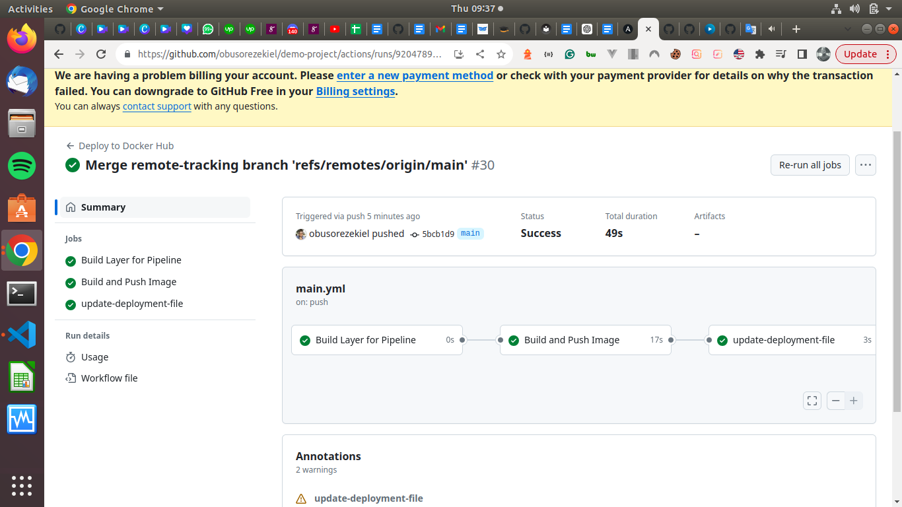

# GitOps with GitHub Actions and ArgoCD.

## Overview



This project demos a CI/CD process using GitHub Actions for continuous integration and ArgoCD for continuous deployment. The pipeline automates the build, testing, and deployment of a web application.

## Prerequisites

- GitHub account
- DockerHub account
- Kubernetes Cluster
- ArgoCD installed in your Kubernetes cluster

### Getting Started

1. **Clone the repository:**

   ```bash
   git clone https://github.com/obusorezekiel/demo-project
   cd demo-project
   cd .github/workflows
   vi main.yml 


### GitHub Actions Workflow Overview

This document provides a detailed explanation of the GitHub Actions workflow defined in the YAML file named `main.yml`. The workflow automates a Continuous Integration/Continuous Deployment (CI/CD) pipeline for a web application hosted on GitHub. The workflow is triggered on pull requests to the `main` branch.

## Workflow Structure

The workflow is organized into multiple jobs, each responsible for specific tasks in the CI/CD process.

### 1. **build-test Job**

- **Purpose:** Executes on pull requests to the `main` branch and performs initial build and test operations.

- **Steps:**
  - Echoes a simple message showing the build and test.

### 2. **docker-build-and-push Job**

- **Purpose:** Depends on the completion of the `build-test` job. It builds a Docker image for the web application, pushes it to DockerHub, and tags it with the commit SHA.

- **Steps:**
  - Checks out the source code using `actions/checkout`.
  - Sets up Docker Buildx for multi-platform builds.
  - Logs in to DockerHub using the provided DockerHub credentials.
  - Builds and pushes the Docker image using `docker/build-push-action`, tagging it with both `latest` and the GitHub run ID.

### 3. **update-deployment Job**

- **Purpose:** Depends on the completion of the `docker-build-and-push` job. Updates the deployment YAML file with the latest Docker image tag.

- **Steps:**
  - Retrieves the Docker image tag from the output of the previous job.
  - Checks out the code and pulls the latest changes from the pull request branch.
  - Sets file permissions for the deployment YAML file.
  - Updates the deployment YAML file with the new Docker image tag using `sed`.
  - Commits the changes with a commit message indicating the image tag update.
  - Pushes the changes back to the pull request branch.

This GitHub Actions workflow automates the entire CI/CD pipeline, including building and testing the application, Dockerizing the application, and updating the deployment configuration. It is designed to enhance the development workflow by providing automated testing and deployment processes.
